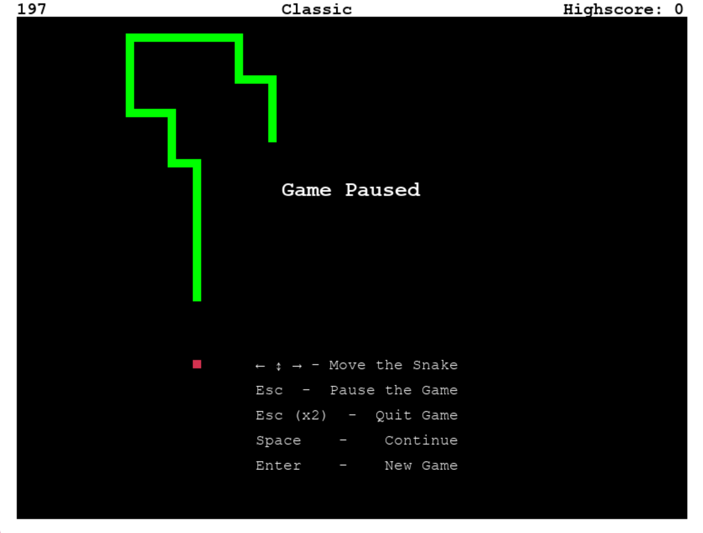
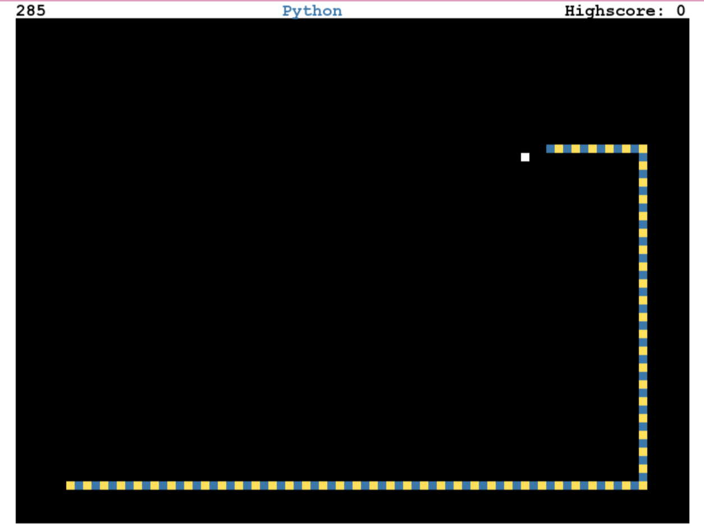
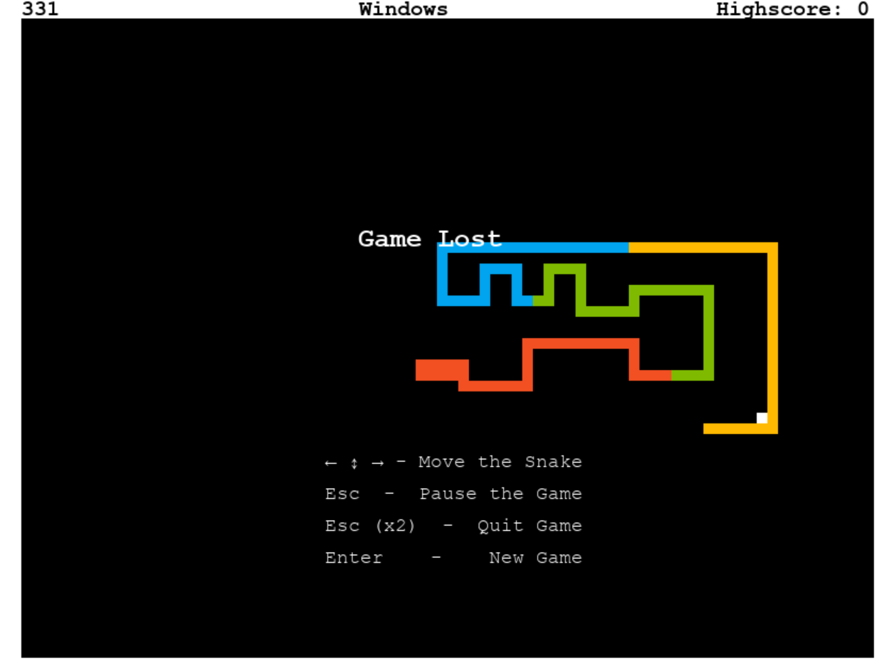

## Table of Contents
1. [Game Features](#game-features)
2. [Game Controls](#game-controls)
3. [Starting the Game](#starting-the-game)

# Snake Game

This is a classic implementation of the Snake game built using Python and Pygame. 

Snake is a game, where the player controls the snake (displayed as a growing line)
with the objective of collecting food from the game board.  
The snake eating food gives the player points and makes the snake grow longer.  
The snake has to grow and survive as long as possible without colliding into 
the borders or itself, which gets increasingly harder as 
the snake takes up more and more space on the game board.


*A paused game showing the default color scheme with a classic green snake.*


*Gameplay using the Python color scheme with a blue and yellow striped snake.*


*Game over screen showcasing the Windows color scheme.*

## Game Features

* **Gameplay**  
The goal of the game is to navigate the snake through the game area and guide it towards food.
Snake grows each time it reaches a food block. 
The game becomes increasingly harder in time as the snake grows and takes up a bigger area of the game board,
while still having to avoid colliding into the borders and its own body.


* **Food Generation**  
Food items appear randomly in the game area one by one. Each time the snake eats one, another will appear, 
until the snake takes up all the room on the board - leaving no room for new foods to be generated.  
Eating the foods causes the snake to grow longer and score points.


* **Superfoods**  
Super food is a special type of food item that appears occasionally during gameplay, 
offering higher points than regular food. Superfoods remain on the game board for a limited amount of time, to encourage 
quick maneuvering and strategic planning, as players have to decide whether to go after the food or focus on safety. 
They are visually distinguishable by their unique color, that changes - darkens - as their time 
remaining on the board decreases, to provide players with a visual cue about how long they have to collect them.
Once the food's lifetime has run out, it will disappear and a new food item will be randomly generated.
  * Score
    * Regular Food: 1 point
    * Superfood variants:
      * 5 points - 10% chance of appearing,
      * 10 points - 4% chance of appearing,
      * 50 points - 1% chance of appearing.
      * Note: The different superfood variants are not visually distinct from one another, 
        to add an element of surprise to the game.


* **Collision Detection**  
The game will end, once the snake either runs into a border or crashes into itself.  
The snake can't move directly backwards, as it would cause self collision. 
The user can try to navigate the snake in the opposite direction, however the snake will not respond to this.
  

* **Winning & Losing**  
Winning the game of snake is quite a challenge. 
The game is won, once the snake has grown enough to fill the entire game board.  
At this point, the player can continue navigating the snake, but no additional food will appear 
due to the lack of space. 
The game will end with a winning status, only if a collision occurs after reaching this maximum length. 
If the snake collides with the border or itself before reaching this length, the game is lost.


* **Pause & Resume**  
The game supports pausing and resuming, allowing players to take breaks without losing their progress. 


* **Score Tracking**  
The game keeps track of the ongoing game's score and stores the gaming session's high score as well, 
to give the player a goal to beat. Both are displayed at the top of the screen. 
Scores are not stored permanently - once the game is closed, the scores will be lost


* **Color Customization**  
The game includes various color schemes to customize the snake and food's visual appearance.  
The themes, which have been added in addition to the default theme, have been included in the game as Easter eggs 
(or should it be called snake egg `;)`). They can be toggled with specific keyboard keys, however 
the game's UI does not mention them, much less include instructions for accessing them.  
Here is a description of 4 of the themes that have been included in the game:
  * **Default color scheme** provides the classic and nostalgic UX of snake game with a green snake and red foods.
  * **Python color scheme** is inspired by the Python programming language logo as the game is written in it, and 
      it doubles as a well-known snake species. 
      The snake is striped with the blue and yellow colors of the logo, and 
      the food items are white, just like the eyes of the snakes on the logo.
  * **Ekans color scheme** is a theme inspired by the snake Pokémon Ekans, whose name spells snake backwards.
      The color palette consists of a purple snake who has a yellow rattle tail. 
      The food is the color of the shiny variation of Ekans, which is green and is a very rare variant of Ekans.
  * **Slytherin color scheme** implements the colors of the Harry Potter Slytherin house (silver and green).
      The Slytherin mascot is a silver serpent with green eyes, and to represent it in the game, 
      the color theme incorporates a silver snake with a green head. 
      The food is colored gold, to represent the Golden Snitch.

## Game Controls

The game is controlled via keyboard buttons.
* **Movement**
  * Use the arrow keys (`←`, `↑`, `→`, `↓`) to control the direction of the snake and guide it towards food.
  * Snake, which is longer than a singular block can't move back in 
    the opposite direction of the direction it is currently moving in, 
    as it would cause the snake to collide with itself.
* **Pausing and Resuming the Game**
  * Pause - Press `Esc` to pause the game.
  * Resume - Press `Space` to resume to the game.
* **Restart and Quit**
  * Starting a new game and quitting entirely can only be done, if the game is already paused.
  * Start a New Game - Press `Enter` to start a new game.
  * Quit the Game - Press `Esc` to quit the game.
* **Color Schemes**
  * Default Color Scheme - Press `Delete` to revert to the default color scheme with a classic green snake and red food.
  * Explore different keyboard letter keys to find the other color schemes in the game.
  * If a snake is patterned, try pressing `Caps Lock` and see what happens ;)

## Starting the Game

To play the Snake Game, you'll need to have Python installed on your machine along with the Pygame library. Follow these steps to get started:

### Prerequisites

- **Python:** You can download the latest version of Python from the official [Python website](https://www.python.org/downloads/).
- **Pygame:** Install Pygame using pip. Open your terminal or command prompt and run:

```bash
pip install pygame
```

### Running the Game

Run the game by executing the following command from your terminal or command prompt: 

```bash
python snake-game.py
```

